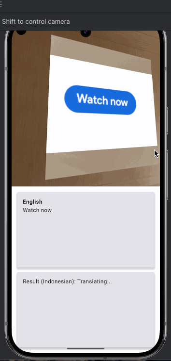
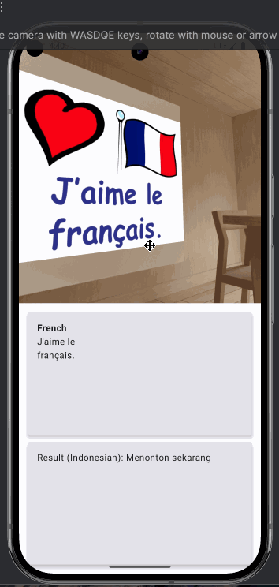

# mlkit-demo-android

ML Kit Demo Android for Google I/O Extended 2025 Android Workshop
> Recognize, Identify Language and Translate text with ML Kit and CameraX: Android

## Requirements

* Git
* JDK 11
* Android Studio Narwhal + SDK
* Android Emulator or Device

## Slide

[Slide](https://docs.google.com/presentation/d/1fYYYlQGaMtAPOXndFM0Viyph0GdUnmBP8LP-4SaNjWM/edit?usp=sharing)

## Demo

| EN-ID                      | FR-ID                      |
|----------------------------|----------------------------|
|  |  |
